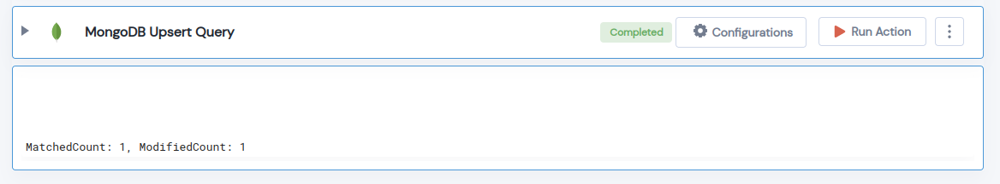

 
<h1> MongoDB Upsert Query<h1>

## Description
 MongoDB Upsert Query

## Lego Details

	mongodb_write_query(handle, database_name: str, collection_name: str, match_query: dict, update: dict, upsert: bool = True)

        handle: Object of type unSkript Mongodb Connector.
        database_name: Name of the MongoDB database.
        collection_name: Name of the MongoDB collection.
        match_query: The selection criteria for the update in dictionary format.
        update: The modifications to apply in dictionary format.
        upsert: Allow creation of a new document, if one does not exist.

## Lego Input
This Lego take six inputs handle, database_name, collection_name, match_query, update  and upsert. 

## Lego Output
Here is a sample output.

## See it in Action

You can see this Lego in action following this link [unSkript Live](https://us.app.unskript.io)