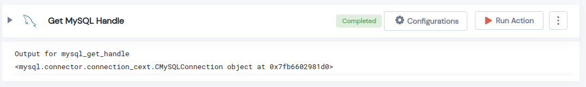

 
<h1>Get MySQL Handle</h1>

## Description
This Lego Retuns MySQL Handle.

## Lego Details

    mysql_get_handle(handle)

        handle: Object of type unSkript MYSQL Connector
        

## Lego Input
This Lego take only one inputs handle. 

## Lego Output
Here is a sample output.

## See it in Action

You can see this Lego in action following this link [unSkript Live](https://us.app.unskript.io)