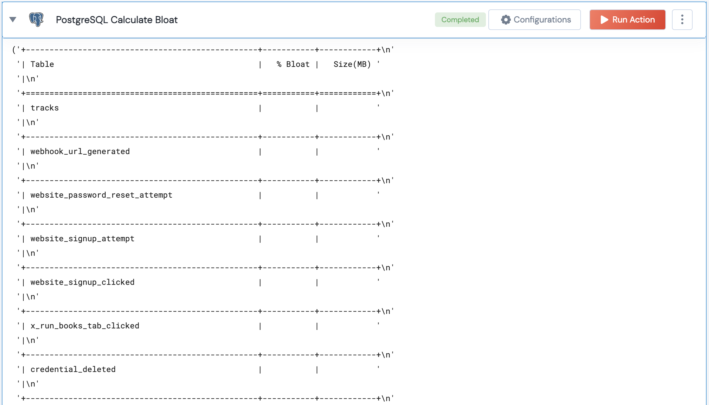

 
<h1>PostgreSQL Calculate Bloat</h1>

## Description
This Lego calculates bloat for tables in Postgres

## Lego Details

    postgres_calculate_bloat(handle)
        handle: Object of type unSkript POSTGRESQL Connector
       

## Lego Input
This Lego take one inputs handle

## Lego Output
Here is a sample output.

## See it in Action

You can see this Lego in action following this link [unSkript Live](https://us.app.unskript.io)