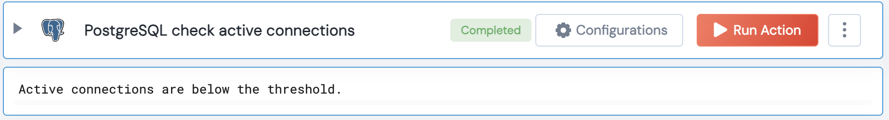

[]
(https://unskript.com/assets/favicon.png)
<h1>PostgreSQL check active connections</h1>

## Description
Check if the active number of connections are exceeding threshold

## Lego Details
	postgresql_check_active_connections(handle, threshold_connections: int = 100)
		handle: Object of type unSkript POSTGRESQL Connector.
		threshold_connections: Optional, number of connections to consider as the threshold.

## Lego Input
This Lego takes inputs handle, threshold_connections.

## Lego Output
Here is a sample output.

## See it in Action

You can see this Lego in action following this link [unSkript Live](https://us.app.unskript.io)