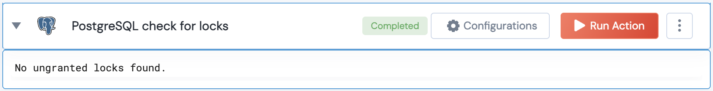

[]
(https://unskript.com/assets/favicon.png)
<h1>PostgreSQL check for locks in database</h1>

## Description
Checks for any locks in the postgres database.

## Lego Details
	postgresql_check_locks(handle)
		handle: Object of type unSkript POSTGRESQL Connector.

## Lego Input
This Lego takes inputs handle.

## Lego Output
Here is a sample output.

## See it in Action

You can see this Lego in action following this link [unSkript Live](https://us.app.unskript.io)