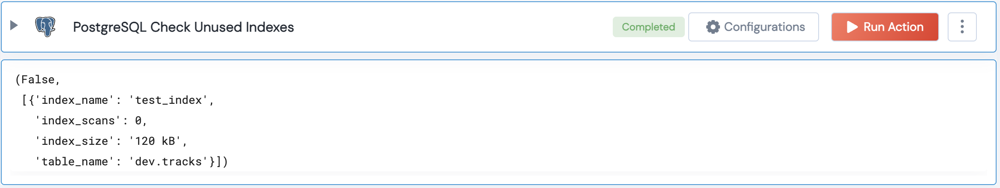

 
<h1>PostgreSQL Check Unused Indexes</h1>

## Description
This Lego finds unused Indexes in a database in PostgreSQL

## Lego Details

    postgresql_check_unused_indexes(handle, index_scans:int, index_size:int) -> Tuple:

        handle: Object of type unSkript POSTGRESQL Connector
        index_scans: Optional, Number of index scans initiated on this index
        index_size: Optional, On-disk size in kB (kilobytes) of the table.
       

## Lego Input
This Lego take 3 inputs handle and index_scans, index_size. 

## Lego Output
Here is a sample output.

## See it in Action

You can see this Lego in action following this link [unSkript Live](https://us.app.unskript.io)