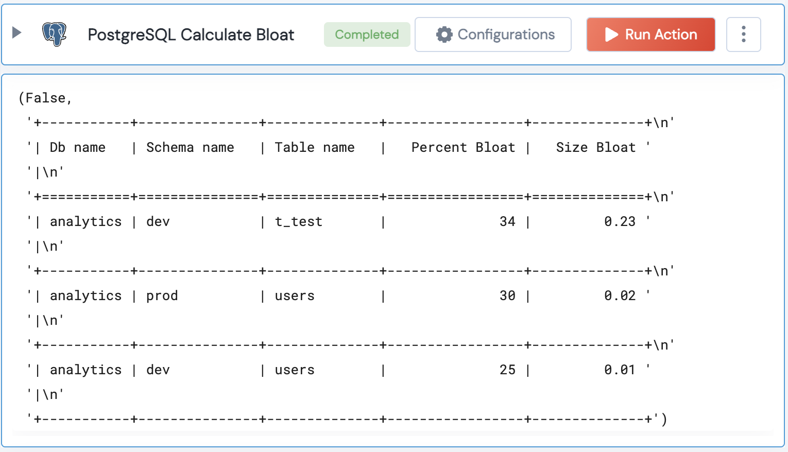

 
<h1>PostgreSQL Find Bloated Tables</h1>

## Description
This Lego finds bloated tables in Postgres

## Lego Details

    postgresql_find_bloated_tables(handle, max_percent_bloat:int, min_percent_bloat:int,max_size_bloat:int, min_size_bloat:int)
        handle: Object of type unSkript POSTGRESQL Connector
        max_percent_bloat: Optional, Upper threshold percentage value of table bloat. By default upper value is set to 50%.
        min_percent_bloat: Optional,  Lower threshold percentage value of table bloat. By default lower value is set to 25%.
        max_size_bloat: Optional, Upper threshold size of table bloat in Megabytes. By default upper value is set to 1000 MB i.e. 1 GB.
        min_size_bloat: Optional, Lower threshold size of table bloat in Megabytes. By default lower value is set to 20 MB.
       

## Lego Input
This Lego take two inputs handle, max_percent_bloat, min_percent_bloat, max_size_bloat, min_size_bloat

## Lego Output
Here is a sample output.

## See it in Action

You can see this Lego in action following this link [unSkript Live](https://us.app.unskript.io)