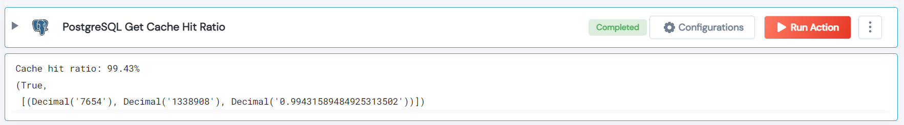

 
<h1>PostgreSQL Get Cache Hit Ratio</h1>

## Description
The result of the action will show the total number of blocks read from disk, the total number of blocks found in the buffer cache, and the cache hit ratio as a percentage. For example, if the cache hit ratio is 99%, it means that 99% of all data requests were served from the buffer cache, and only 1% required reading data from disk..

## Lego Details

    postgresql_get_cache_hit_ratio(handle) 

        handle: Object of type unSkript POSTGRESQL Connector
       

## Lego Input
This Lego take one input handle.

## Lego Output
Here is a sample output.

## See it in Action

You can see this Lego in action following this link [unSkript Live](https://us.app.unskript.io)