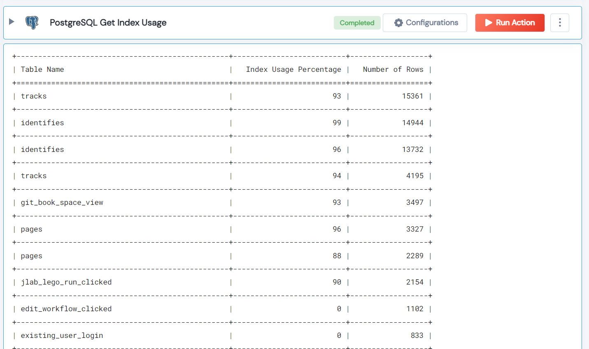

 
<h1>PostgreSQL Get Index Usage</h1>

## Description
This Lego shows the data for table name, the percentage of times an index was used for that table, and the number of live rows in the table.

## Lego Details

    postgresql_get_index_usage(handle)

        handle: Object of type unSkript POSTGRESQL Connector
       

## Lego Input
This Lego take one input handle.

## Lego Output
Here is a sample output.

## See it in Action

You can see this Lego in action following this link [unSkript Live](https://us.app.unskript.io)