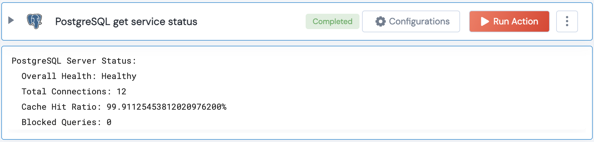

[]
(https://unskript.com/assets/favicon.png)
<h1>PostgreSQL get service status</h1>

## Description
This action checks the status of each database.

## Lego Details
	postgresql_get_service_status(handle, connection_threshold: int = 100, cache_hit_ratio_threshold: int = 90, blocked_query_threshold: int = 5)
		handle: Object of type unSkript POSTGRESQL Connector.
		connection_threshold: Threshold for the number of connections considered abnormal
		cache_hit_ratio_threshold: Threshold for the cache hit ratio considered abnormal
		blocked_query_threshold: Threshold for the number of blocked queries considered abnormal

## Lego Input
This Lego takes inputs handle, connection_threshold, cache_hit_ratio_threshold, blocked_query_threshold.

## Lego Output
Here is a sample output.

## See it in Action

You can see this Lego in action following this link [unSkript Live](https://us.app.unskript.io)