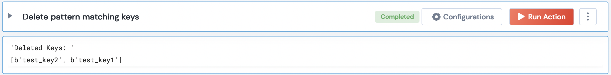

 
<h1>Delete All Redis keys</h1>

## Description
Returns list of all deleted Redis keys

## Lego Details
    redis_delete_all_keys(handle)
        handle: Object of type unSkript Redis Connector

## Lego Input
This Lego takes 1 input: handle

## Lego Output
Here is a sample output.

