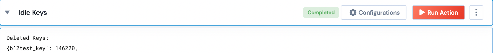

 
<h1>Delete Redis Stale keys count</h1>

## Description
Returns Deleted Redis Unused keys given a time threshold in seconds.

## Lego Details
    redis_delete_stale_keys(handle, time_in_sec: int)
        handle: Object of type unSkript Redis Connector
        time_in_sec: Threshold Idle Time in Seconds

## Lego Input
This Lego takes 2 inputs: handle and time_in_sec

## Lego Output
Here is a sample output.

