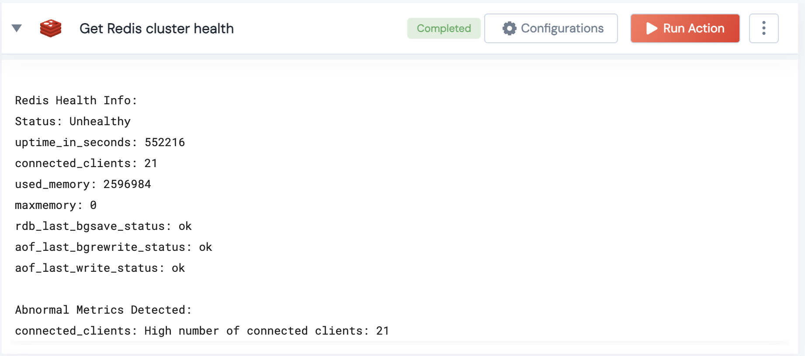

[]
(https://unskript.com/assets/favicon.png)
<h1>Get Redis cluster health</h1>

## Description
This action gets the Redis cluster health.

## Lego Details
	redis_get_cluster_health(handle, client_threshold: int = 100, memory_threshold: int = 80)
		handle: Object of type unSkript REDIS Connector.
		client_threshold: Threshold for the number of connected clients considered abnormal
		memory_threshold: Threshold for the percentage of memory usage considered abnormal

## Lego Input
This Lego takes inputs handle, client_threshold, memory_threshold.

## Lego Output
Here is a sample output.

## See it in Action

You can see this Lego in action following this link [unSkript Live](https://us.app.unskript.io)