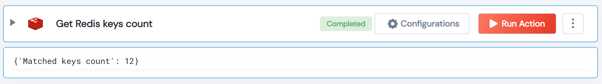

 
<h1>Get Redis keys count</h1>

## Description
Returns Redis keys count matching pattern (default: '*')

## Lego Details
    redis_get_keys_count(handle, pattern: str)
        handle: Object of type unSkript Redis Connector
        pattern: Pattern for the searched keys

## Lego Input
This Lego takes 2 inputs: handle and pattern.

## Lego Output
Here is a sample output.

