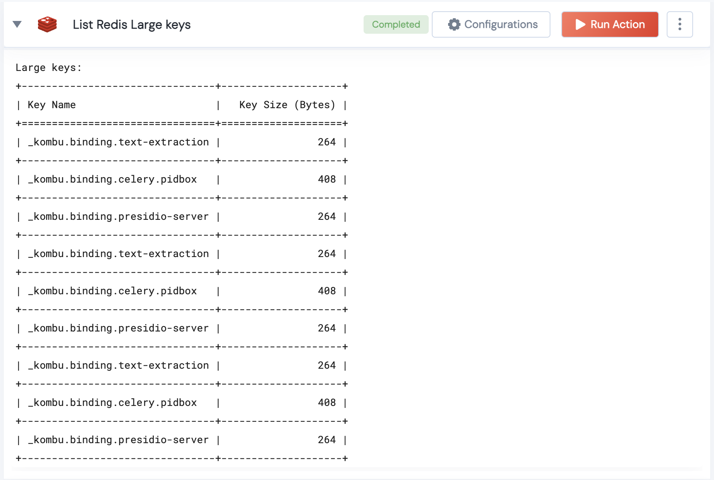

 
<h1>List Redis Large keys</h1>

## Description
Returns Large Redis keys given a threshold length in bytes.

## Lego Details
    redis_list_large_keys(handle, time_in_sec: int)
        handle: Object of type unSkript Redis Connector
        size_in_bytes: Threshold Length of Key in Bytes

## Lego Input
This Lego takes 2 inputs: handle and size_in_bytes

## Lego Output
Here is a sample output.

