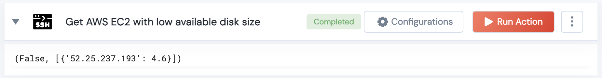

[]
(https://unskript.com/assets/favicon.png)
<h1>Get AWS EC2 with low available disk size</h1>

## Description
This action retrieves the public IP's of AWS EC2 instances that have low available disk space.

## Lego Details
	ssh_get_ec2_instances_with_low_available_disk_size(handle, hosts: list, threshold: float = 5)
		handle: Object of type unSkript SSH Connector.
		hosts: List of hosts to connect to.
		threshold: The disk size threshold in GB.(Optional)

## Lego Input
This Lego takes inputs handle, hosts, threshold.

## Lego Output
Here is a sample output.

## See it in Action

You can see this Lego in action following this link [unSkript Live](https://us.app.unskript.io)