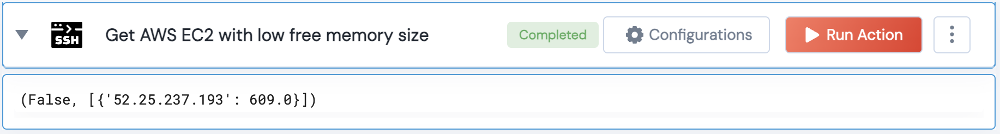

[]
(https://unskript.com/assets/favicon.png)
<h1>Get AWS EC2 with low free memory size</h1>

## Description
This action uses SSH to identify AWS EC2 instances with low available memory.

## Lego Details
	ssh_get_ec2_instances_with_low_memory_size(handle, hosts: list, threshold: float = 400)
		handle: Object of type unSkript SSH Connector.
		hosts: List of hosts to connect to.
		threshold: The memory size threshold in MB.(Optional)

## Lego Input
This Lego takes inputs handle,

## Lego Output
Here is a sample output.

## See it in Action

You can see this Lego in action following this link [unSkript Live](https://us.app.unskript.io)