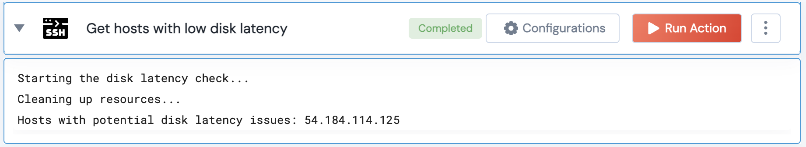

[]
(https://unskript.com/assets/favicon.png)
<h1>Get hosts with low disk latency </h1>

## Description
This action checks the disk latency on the provided hosts by running a disk write command and measuring the time taken. If the time taken exceeds a given threshold, the host is flagged as having potential latency issues.

## Lego Details
	ssh_get_hosts_with_low_disk_latency(handle, hosts: list, threshold: int = 5)
		handle: Object of type unSkript SSH Connector.
		hosts: List of hosts to connect to.
		threshold: Time threshold in seconds to flag a host for potential latency issues.

## Lego Input
This Lego takes inputs handle, hosts, threshold.

## Lego Output
Here is a sample output.

## See it in Action

You can see this Lego in action following this link [unSkript Live](https://us.app.unskript.io)