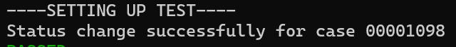

 
<h2>Change Salesforce Case Status</h2>

 

## Description
This Lego change Salesforce Case Status.

## Lego Details

    salesforce_case_change_status(handle: object, case_number: str, status: Status)

        handle: Object of type unSkript Salesforce Connector
        case_number: The Case number to get the details about the case
        status: Salesforce Case Status. Possible values: New|Working|Escalated

## Lego Input
This Lego take three inputs handle, case_number and status.

## Lego Output
Here is a sample output.

## See it in Action

You can see this Lego in action following this link [unSkript Live](https://us.app.unskript.io)