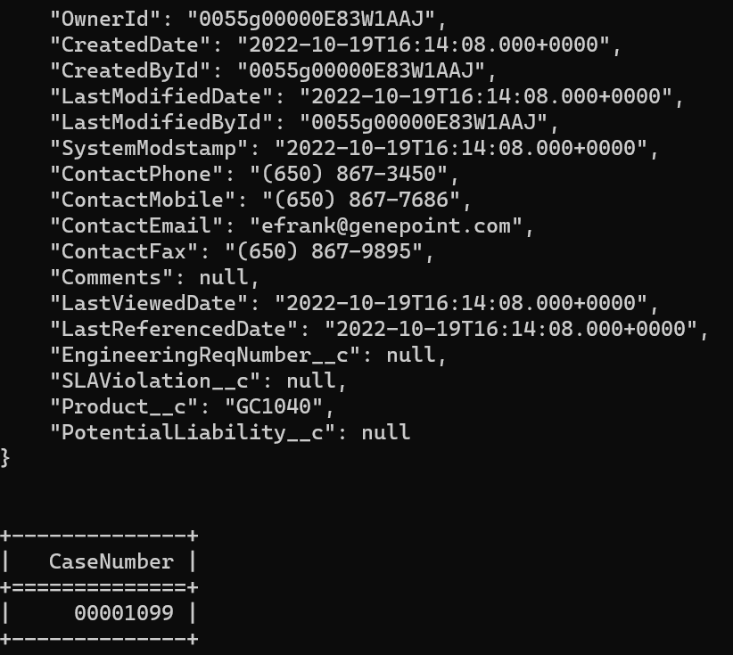

 
<h2>Create Salesforce Case</h2>

 

## Description
This Lego create Salesforce Case.

## Lego Details

    salesforce_create_case(handle: object, status: Status, case_origin: CaseOrigin, priority: Priority,
                           contact_name: str, account_name: str, type: CaseType, case_reason: CaseReason,
                           subject: str, description: str, internal_comments: str, additional_information: dict,
                           web_information: dict)

        handle: Object of type unSkript Salesforce Connector
        status: The status of the case. Default is "New"
        case_origin: The origin of the case.
        priority: The priority of the case.
        contact_name: The name of the contact.
        account_name: The name of the Account.
        type: The type of the case.
        case_reason: The Reason for the case.
        subject: Title of the case.
        escription: A short description about the case.
        internal_comments: Comments about thw case.
        additional_information:
        web_information: 

## Lego Input
This Lego take thirteen inputs handle, status, case_origin, priority, contact_name, account_name, type, case_reason,
                           subject, description, internal_comments, additional_information and
                           web_information.

## Lego Output
Here is a sample output.

## See it in Action

You can see this Lego in action following this link [unSkript Live](https://us.app.unskript.io)