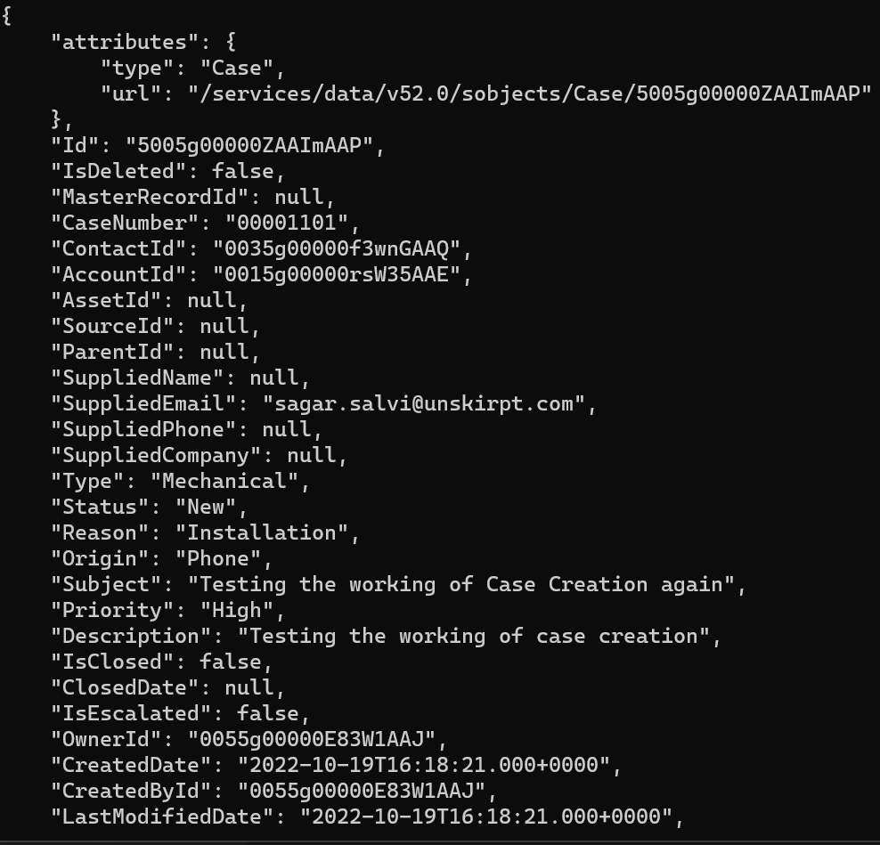

 
<h2>Get Salesforce Case Info</h2>

 

## Description
This Lego gets the details about a particular case.

## Lego Details

    salesforce_get_case(handle: object, case_number: str)

        handle: Object of type unSkript Salesforce Connector
        case_number: The Case number to get the details about the case

## Lego Input
This Lego take two inputs handle and case_number.

## Lego Output
Here is a sample output.

## See it in Action

You can see this Lego in action following this link [unSkript Live](https://us.app.unskript.io)