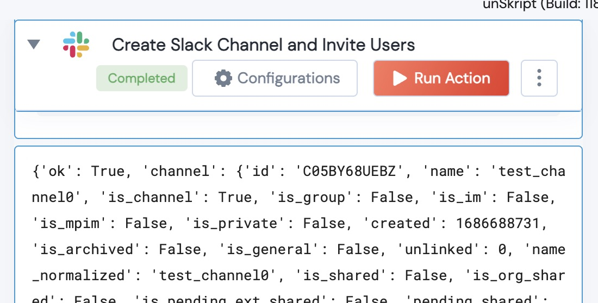

[]
(https://unskript.com/assets/favicon.png)
<h1>Slack Create Channel and Invite Users</h1>

## Description
Create a Slack channel and invite user IDs to the channel. Useful for triaging issues.

## Action Details
def slack_create_channel_invite_users(
        handle: WebClient,
        channel: str,
        user_list: list) -> str:

*Channel: name of channel to add
*user_list: List of userIDs to invite to the new channel.

## Action Output
Here is a sample output.

## See it in Action

You can see this Lego in action following this link [unSkript Live](https://us.app.unskript.io)