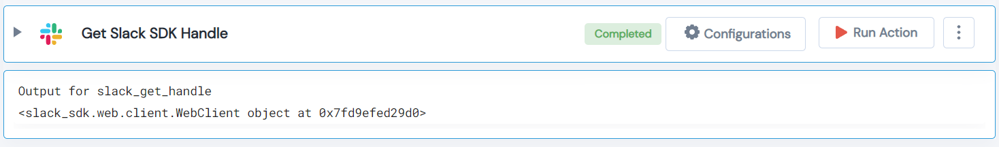

 
<h1>Get Slack SDK Handle </h1>

## Description
This Lego get Slack SDK Handle.

## Lego Details

    slack_get_handle(handle: object)

        handle: Object of type unSkript Slack Connector

## Lego Input
This Lego take one inputs handle.

## Lego Output
Here is a sample output.

## See it in Action
You can see this Lego in action following this link [unSkript Live](https://unskript.com)