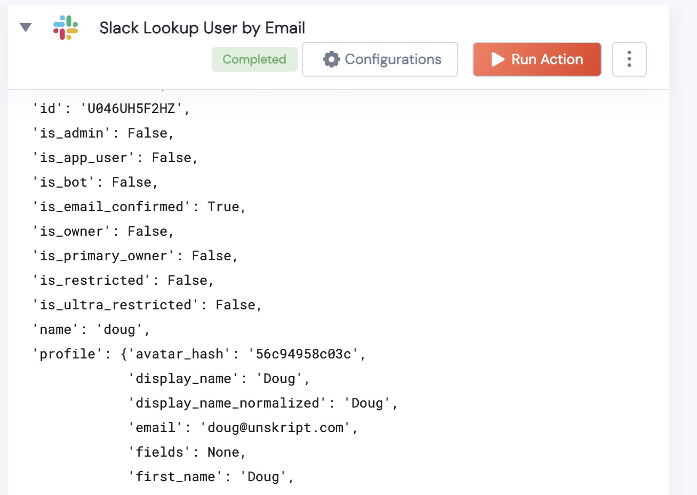

[]
(https://unskript.com/assets/favicon.png)
<h1>Slack Lookup User by Email</h1>

## Description
Given an email address, find the slack user in the workspace.

You can the extract their Profile picture, or retrieve their userid (which you can use to send messages) from the output

## Action Details
def slack_lookup_user_by_email(
        handle: WebClient,
        email: str) -> Dict:
		
		email: Teh email address of the user you wish to lookup.
## Action Output
Here is a sample output.

## Try it Out

You Try this Action in the unSkript [Free Trial](https://us.app.unskript.io/), or using the [open source Docker image](http://runbooks.sh).