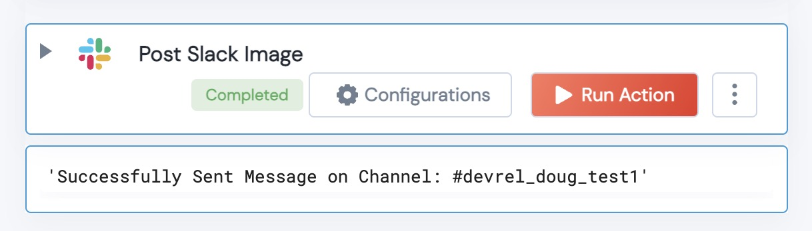
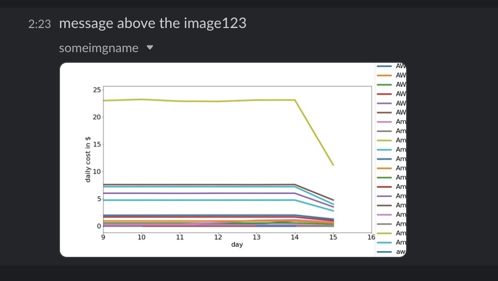

[](https://unskript.com/assets/favicon.png) 
<h1>Post Slack Message with an Image</h1>

## Description
This Lego Post Slack Message with an Image and gives a message sent status.


## Lego Details

    slack_post_image(handle: object, channel: str, message: str, image: str)

        handle: Object of type unSkript AWS Connector
        channel: Name of slack channel.
        message: Message sent to channel.
        image: File Name of the image to be sent in the message.
    
    Note: Your Slack App will need the ```files:write``` scope.  Your Bot will also need to be a member of the channel that you wish to send the message to.


## Lego Input
This Lego take four inputs handle, channel, message and image.

## Lego Output
Here is a sample output.



## See it in Action
You can see this Lego in action following this link [unSkript Live](https://unskript.com)