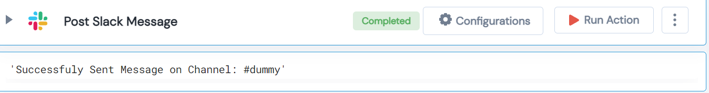

 
<h1>Post Slack Message </h1>

## Description
This Lego Post Slack Messageand gives a message sent status.

## Lego Details

    slack_post_message(handle: object, channel: str, message: str)

        handle: Object of type unSkript AWS Connector
        channel: Name of slack channel.
        message: Message sent to channel.

## Lego Input
This Lego takes take one input region. 

## Lego Output
Here is a sample output.

## See it in Action

You can see this Lego in action following this link [unSkript Live](https://unskript.com)