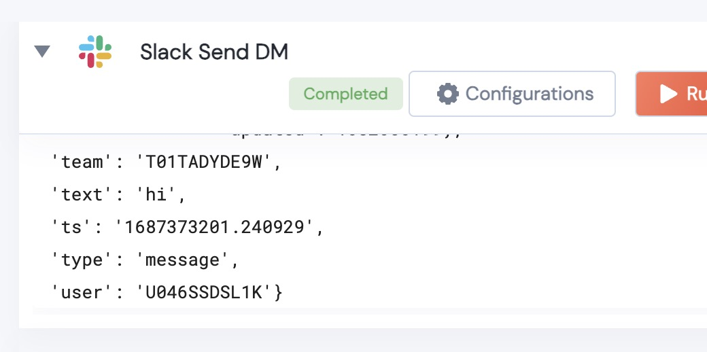
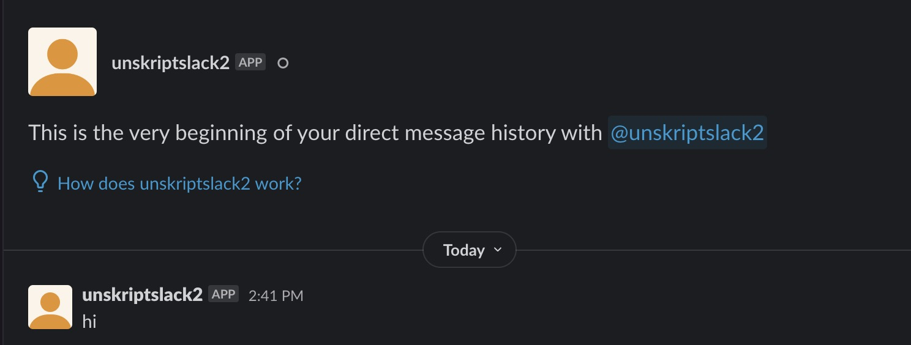

[]
(https://unskript.com/assets/favicon.png)
<h1>Slack Send DM</h1>

## Description
Given a list of Slack IDs, this Action will create a DM (one user) or group chat (multiple users), and send a message to the chat

## Action Details
	def slack_send_DM(
	        handle: WebClient,
	        users: list,
	        message:str) -> Dict:
		handle: Object of type unSkript Slack Connector.

		* users: The list of users to be added to the chat.  One user creates a DM, multiple users, a group chat.
		* message: The intro message to the chat from the bot.

 
## Action Output
Here is a sample output.

## Try it Out

You Try this Action in the unSkript [Free Trial](https://us.app.unskript.io/), or using the [open source Docker image](http://runbooks.sh).