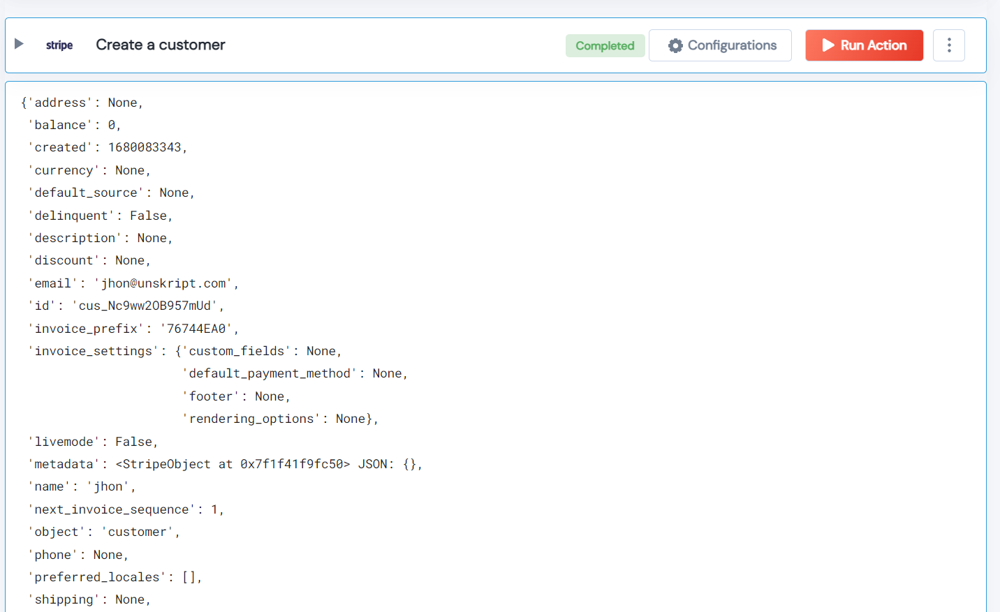

 
<h2>Create a customer</h2>

 

## Description
This Lego used to Create a customer.

## Lego Details

    stripe_create_customer(handle: object, params:dict)

        handle: Object of type unSkript stripe Connector
        params: Params in key=value form.

## Lego Input
This Lego take two input handle and params.

## Lego Output
Here is a sample output.

## See it in Action

You can see this Lego in action following this link [unSkript Live](https://us.app.unskript.io)