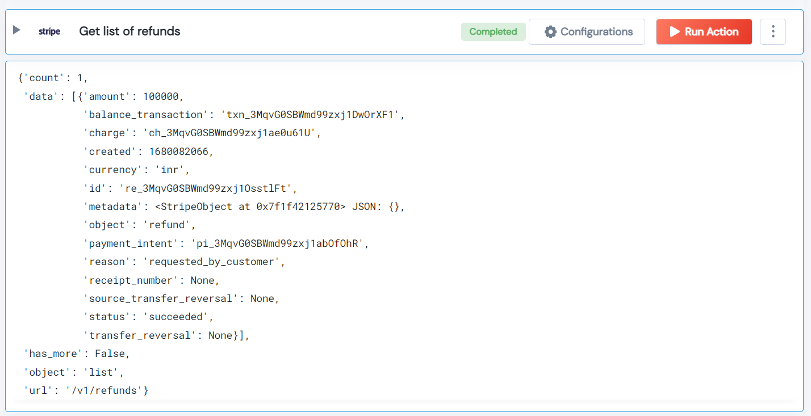

 
<h2>Get list of refunds</h2>

 

## Description
This Lego used to list of refunds that was perviously created. The
        charges are returned in sorted order, with the most recent charges appearing first.

## Lego Details

    stripe_get_all_refunds(handle: object)

        handle: Object of type unSkript stripe Connector

## Lego Input
This Lego take one input handle.

## Lego Output
Here is a sample output.

## See it in Action

You can see this Lego in action following this link [unSkript Live](https://us.app.unskript.io)