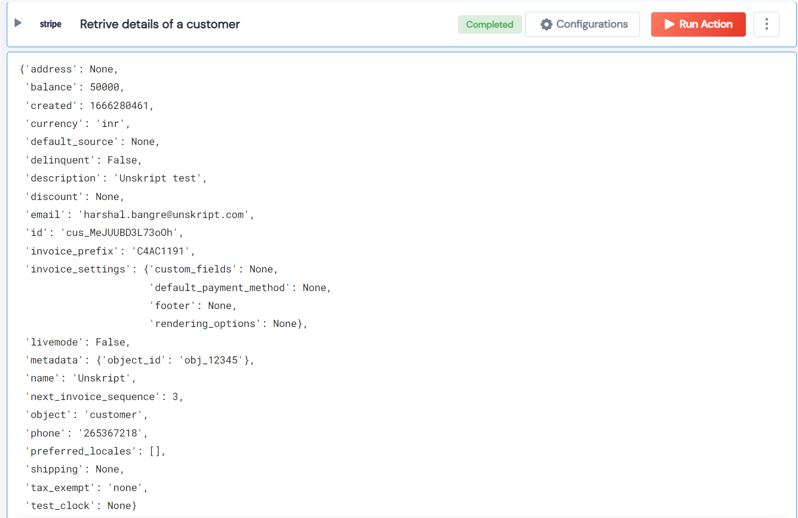

 
<h2>Retrive details of a customer</h2>

 

## Description
This Lego get customer data.

## Lego Details

    stripe_retrieve_customer(handle: object, customer_id:str)

        handle: Object of type unSkript stripe Connector
        customer_id: Retrive details of a customer.

## Lego Input
This Lego take two input handle and customer_id.

## Lego Output
Here is a sample output.

## See it in Action

You can see this Lego in action following this link [unSkript Live](https://us.app.unskript.io)