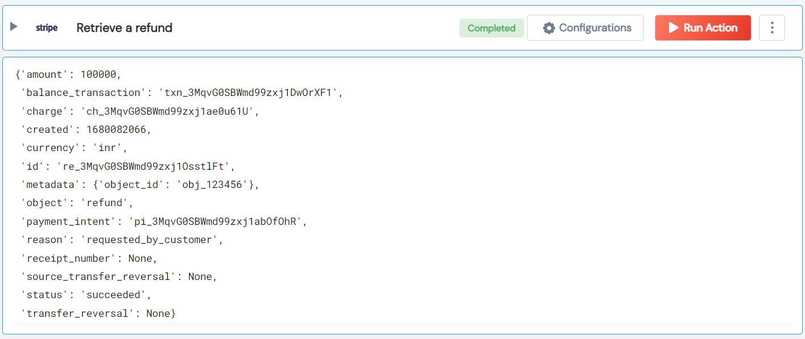

 
<h2>Retrieve a refund</h2>

 

## Description
This Lego retrieve a refund.

## Lego Details

    stripe_retrieve_refund(handle: object, refund_id:str)

        handle: Object of type unSkript stripe Connector
        refund_id: The identifier of the refund.

## Lego Input
This Lego take two input handle and refund_id.

## Lego Output
Here is a sample output.

## See it in Action

You can see this Lego in action following this link [unSkript Live](https://us.app.unskript.io)