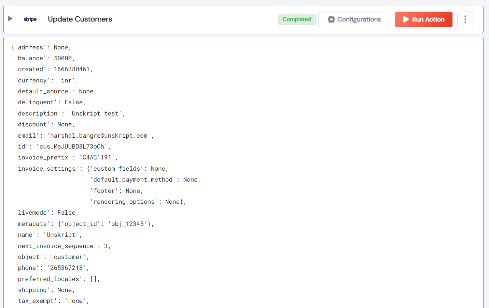

 
<h2>Update Customers</h2>

 

## Description
This Lego Update Customers.

## Lego Details

    stripe_close_dispute(handle: object, customer_id: str, name: str, phone: str, description: str,
        email: str, balance: int, metadata: dict, shipping: dict, address: dict)

        handle: Object of type unSkript stripe Connector
        customer_id: Customer ID
        name: The customer’s full name or business name.
        phone: The customer’s phone number.
        description: Description
        email: Customer’s email address
        balance: Current Balance
        metadata: This can be useful for storing additional information about the object in a structured format.
        shipping: Shipping information for the customer.
        address: The customer’s address.

## Lego Input
This Lego take ten input handle, customer_id, name, phone, description, email, balance, metadata, shipping and address.

## Lego Output
Here is a sample output.

## See it in Action

You can see this Lego in action following this link [unSkript Live](https://us.app.unskript.io)