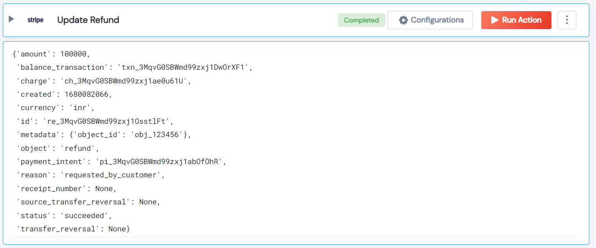

 
<h2>Update Refund</h2>

 

## Description
This Lego Updates the specified refund by setting the values of the parameters passed.

## Lego Details

    stripe_update_refund(handle: object, refund_id:str, metadata:dict)

        handle: Object of type unSkript stripe Connector
        metadata: Updates the specified refund by setting the values of the parameters passed.
        refund_id: Refund Id

## Lego Input
This Lego take three input handle, metadata and refund_id.

## Lego Output
Here is a sample output.

## See it in Action

You can see this Lego in action following this link [unSkript Live](https://us.app.unskript.io)