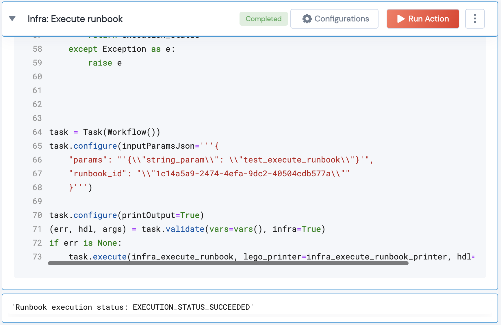

 
<h2>Infra: Execute runbook</h2>

 

## Description
This Lego use this action to execute particular runbook with given input parameters.

## Lego Details

    infra_execute_runbook(handle: object, runbook_id: str, params: str)

        handle: Object of type unSkript infra Connector
        runbook_id: ID of the runbook to execute.
        params: JSON string of runbook input parameters.

        

## Lego Input
This Lego take three inputs handle, runbook_id and params.

## Lego Output
Here is a sample output.

## See it in Action

You can see this Lego in action following this link [unSkript Live](https://us.app.unskript.io)