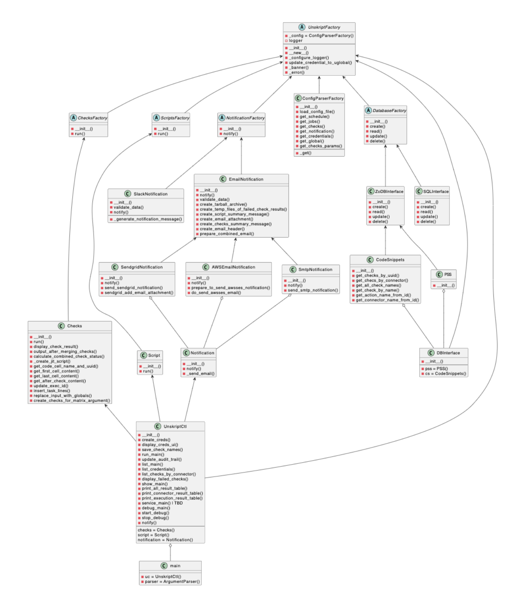

<br />
<div align="center">
    <a href="https://unskript.com/">
        
    </a>
    <p align="center">
</p>
</div>

# Design Consideration

This document describes the design consideration that was the basis for refactoring unskript-ctl 

* Reusable Classes 
* Mockable Classes 
* Easily replacable components

The refactored code reflects these three points. Below the UML representation and the Pictorial representation is provided to help understand the code and to help with maintaining the code. 

## UML representation
```
@startuml
abstract class UnskriptFactory {
    - _config = ConfigParserFactory()
    - logger 
    --
    - __init__()
    - __new__()
    - _configure_logger()
    - update_credential_to_uglobal()
    - _banner()
    - _error()
}

abstract class ChecksFactory {
    - __init__()
    - run()
}

abstract class ScriptsFactory {
    - __init__()
    - run()
}

abstract class NotificationFactory {
    - __init__()
    - notify() 
}

class ConfigParserFactory {
    - __init__()
    - load_config_file()
    - get_schedule()
    - get_jobs()
    - get_checks()
    - get_notification()
    - get_credentials()
    - get_global()
    - get_checks_params()
    --
    - _get()
}

abstract class DatabaseFactory {
    - __init__()
    - create()
    - read()
    - update()
    - delete()
}

UnskriptFactory <-- ChecksFactory
UnskriptFactory <-- ScriptsFactory
UnskriptFactory <-- NotificationFactory
UnskriptFactory <-- ConfigParserFactory
UnskriptFactory <-- DatabaseFactory 

class ZoDBInterface {
    - __init__()
    - create()
    - read()
    - update()
    - delete()
}

class SQLInterface {
    - __init__()
    - create()
    - read()
    - update()
    - delete()
}

DatabaseFactory <-- ZoDBInterface
DatabaseFactory <-- SQLInterface 

class CodeSnippets {
    - __init__()
    - get_checks_by_uuid()
    - get_checs_by_connector()
    - get_all_check_names()
    - get_check_by_name()
    - get_action_name_from_id()
    - get_connector_name_from_id()
}

ZoDBInterface <-- CodeSnippets

class PSS {
    - __init__()
}

ZoDBInterface <-- PSS 

class DBInterface {
    - __init__()
    --
    - pss = PSS()
    - cs = CodeSnippets()
}

UnskriptFactory <-- DBInterface

PSS o-- DBInterface
CodeSnippets o-- DBInterface

class SlackNotification {
    - __init__()
    - validate_data()
    - notify()
    --
    - _generate_notification_message()
}

NotificationFactory <-- SlackNotification

class EmailNotification {
    - __init__()
    - notify()
    - validate_data()
    - create_tarball_archive()
    - create_temp_files_of_failed_check_results()
    - create_script_summary_message()
    - create_email_attachment()
    - create_checks_summary_message()
    - create_email_header()
    - prepare_combined_email()
}

NotificationFactory <-- EmailNotification

class SendgridNotification {
    - __init__()
    - notify()
    - send_sendgrid_notification()
    - sendgrid_add_email_attachment()
}

EmailNotification <-- SendgridNotification

class AWSEmailNotification {
    - __init__()
    - notify()
    - prepare_to_send_awsses_notification()
    - do_send_awsses_email()
}

EmailNotification <-- AWSEmailNotification

class SmtpNotification {
    - __init__()
    - notify()
    - send_smtp_notification()
}

EmailNotification <-- SmtpNotification

class Notification {
    - __init__()
    - notify() 
    - _send_email()
}

SmtpNotification o-- Notification 
AWSEmailNotification o-- Notification
SendgridNotification o-- Notification

class Checks {
    - __init__()
    - run()
    - display_check_result()
    - output_after_merging_checks()
    - calculate_combined_check_status()
    - _create_jit_script()
    - get_code_cell_name_and_uuid()
    - get_first_cell_content()
    - get_last_cell_content()
    - get_after_check_content()
    - update_exec_id()
    - insert_task_lines()
    - replace_input_with_globals()
    - create_checks_for_matrix_argument()
}

ChecksFactory <-- Checks

class Script {
    - __init__()
    - run()
}

ScriptsFactory <-- Script

class UnskriptCtl {
    - __init__()
    - create_creds()
    - display_creds_ui()
    - save_check_names()
    - run_main()
    - update_audit_trail()
    - list_main()
    - list_credentials()
    - list_checks_by_connector()
    - display_failed_checks()
    - show_main()
    - print_all_result_table()
    - print_connector_result_table()
    - print_execution_result_table()
    - service_main() | TBD
    - debug_main()
    - start_debug()
    - stop_debug()
    - notify()
    --
    checks = Checks()
    script = Script()
    notification = Notification()
}

UnskriptFactory <-- UnskriptCtl

Checks <-- UnskriptCtl
Script <-- UnskriptCtl
Notification <-- UnskriptCtl

class main {
    - uc = UnskriptCtl()
    - parser = ArgumentParser()
}

UnskriptCtl o-- main

@enduml
```

## Pictorial representation 



